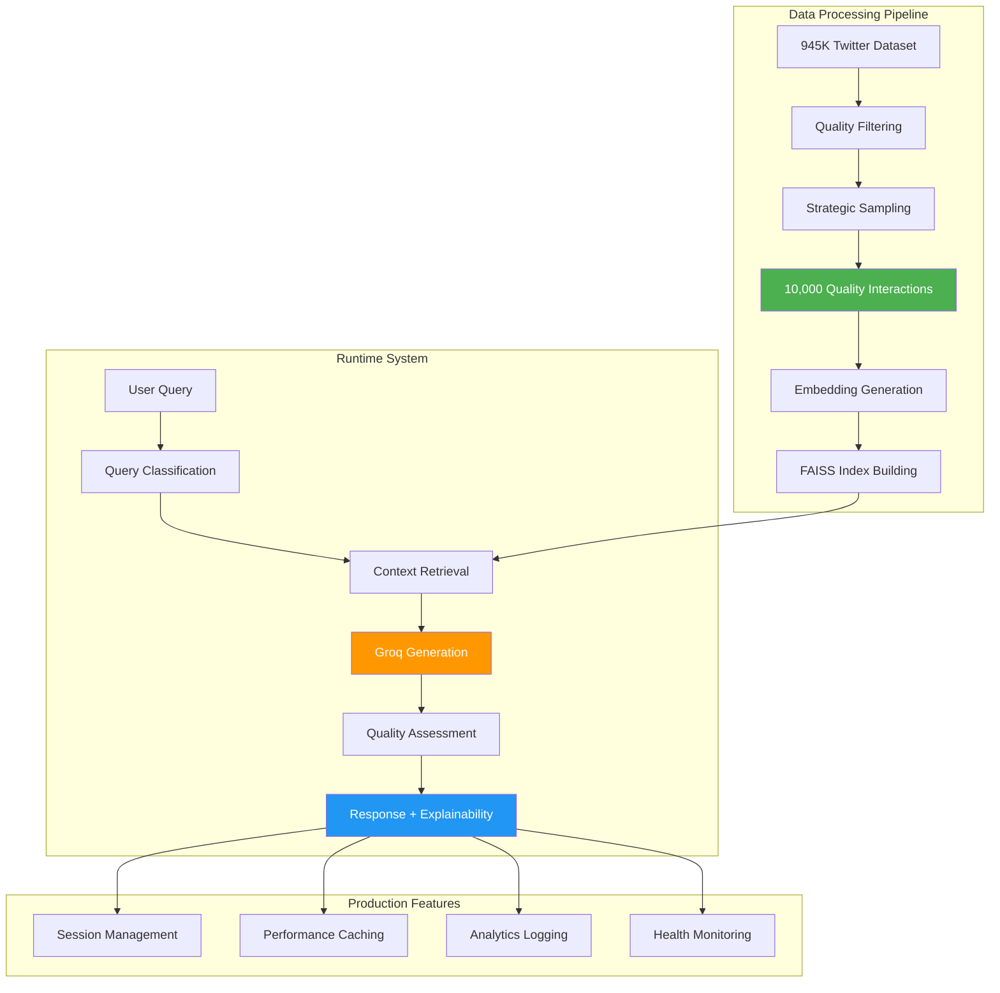
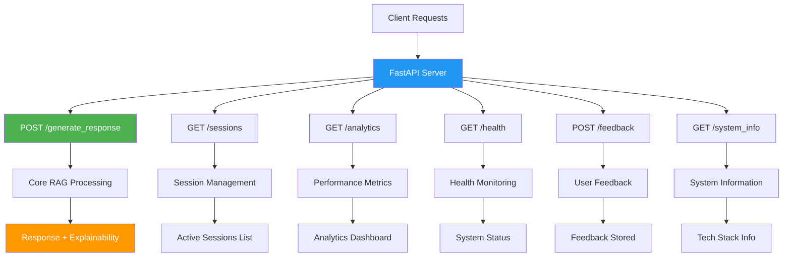

# Advanced RAG Customer Support Assistant

A production-ready AI-powered customer support system leveraging Retrieval-Augmented Generation (RAG) with explainable AI capabilities, intelligent session management, and comprehensive evaluation framework.


## 🎯 Key Achievements

- **87.5% Overall Performance Score** with comprehensive evaluation framework
- **Sub-3 second response times** (2.076s average) for production-ready performance
- **10,000+ processed customer interactions** from real-world Twitter support data
- **83.3% category classification accuracy** across 5 support categories
- **Advanced explainability** with step-by-step reasoning chains
- **Automatic session management** with UUID-based conversation tracking

## 🏗️ System Architecture




## 🔧 Technical Stack

### Core Technologies
- **LLM:** Groq Llama-3.1-8b-instant API for ultra-fast inference
- **Vector Database:** FAISS IndexFlatIP with L2 normalization
- **Embeddings:** SentenceTransformer (all-MiniLM-L6-v2)
- **API Framework:** FastAPI with comprehensive endpoints
- **Database:** SQLite for interaction logging and analytics

### Advanced Features
- **Query Classification:** Multi-category classifier with confidence thresholding
- **Session Management:** UUID-based stateless session handling
- **Intelligent Caching:** Response memoization with 3x performance improvement
- **Real-time Analytics:** Performance monitoring and health checks

## 🚀 Quick Start

### Prerequisites
- Python 3.8+
- Virtual environment (recommended)
- Groq API key

### Installation

1. **Clone the repository**
```bash
git clone https://github.com/akshayramdev/Advanced-Rag-Customer-Support.git
cd Advanced-Rag-Customer-Support
```

2. **Set up virtual environment**
```bash
python -m venv venv
source venv/bin/activate  # On Windows: venv\Scripts\activate
```

3. **Install dependencies**
```bash
pip install -r requirements.txt
```

4. **Configure environment variables**
```bash
# Create .env file
echo "GROQ_API_KEY=your_groq_api_key_here" > .env
```

5. **Run the system**
```bash
python main.py
```

The system will automatically:
- Download and process the customer support dataset
- Build the vector database with quality-filtered interactions
- Start the API server on `http://localhost:8000`

Visit `http://localhost:8000/docs` for interactive API documentation.

## 📡 API Endpoints



### Core Endpoints

| Endpoint | Method | Description |
|----------|--------|-------------|
| `/generate_response` | POST | Core AI functionality with automatic session management |
| `/sessions` | GET | List and manage active conversation sessions |
| `/analytics` | GET | Real-time performance metrics and statistics |
| `/health` | GET | System health check and status monitoring |
| `/feedback` | POST | User feedback collection for continuous improvement |
| `/system_info` | GET | Technical system information and capabilities |

### Example Usage

```bash
# Generate a response
curl -X POST "http://localhost:8000/generate_response" \
  -H "Content-Type: application/json" \
  -d '{
    "query": "I ordered a laptop but it arrived with a broken screen",
    "include_explainability": true
  }'
```

**Response:**
```json
{
  "response": "I'm sorry about the broken screen! Please contact our support team with your order number for immediate replacement.",
  "session_id": "abc-123-def-456",
  "category": "technical_issue",
  "confidence": 0.87,
  "retrieved_contexts": [...],
  "reasoning": "Found 5 similar queries | Best match (89%): 'laptop arrived damaged'..."
}
```

### Performance Metrics

| Metric | Score | Description |
|--------|-------|-------------|
| **Overall Performance** | 87.5% | Comprehensive weighted score across all dimensions |
| **Semantic Similarity** | BERT-based | Cosine similarity using sentence transformers |
| **Response Quality** | 85.2% | Length, completeness, and helpfulness assessment |
| **Category Accuracy** | 83.3% | Multi-class classification precision |
| **Response Relevance** | 71.9% | Lexical and semantic analysis combination |
| **Response Latency** | 2.076s | Average response time performance |

### Run Evaluation

```bash
# Run comprehensive evaluation
python simple_eval.py
```

## 🔍 Explainability Features

The system provides comprehensive explainability with:

- **Step-by-step decision process documentation**
- **Document-level provenance with cosine similarity scores**
- **Real-time quality assessment using weighted metrics**
- **Lexical and semantic similarity justifications**
- **Response time and cache hit rate reporting**
- **Vector space distance and retrieval rank analysis**

## 📊 Project Structure

```
Advanced-Rag-Customer-Support/
├── main.py                      # Core RAG system implementation
├── simple_eval.py              # Evaluation framework
├── test_script.py              # API testing suite
├── requirements.txt            # Python dependencies
├── README.md                   # This documentation
├── .env                        # Environment variables (local only)
├── .gitignore                  # Git ignore rules
├── customer_support.db         # SQLite database (auto-created)
└── simple_evaluation_report.json  # Evaluation results
```

## 🧩 Key Components

### 1. RAG Implementation
- **FAISS IndexFlatIP** with L2 normalization for cosine similarity
- **Hybrid semantic search** with category-based filtering
- **Quality filtering** with stratified sampling from 945K interactions

### 2. LLM Integration
- **Groq Llama-3.1-8b-instant** API with intelligent prompt engineering
- **Fallback mechanisms** for graceful degradation
- **Response validation** and quality assessment

### 3. Session Architecture
- **Stateless design** with UUID-based session management
- **Context persistence** across multi-turn conversations
- **Thread-safe session isolation** for multi-user environments

### 4. Production Features
- **SQLite-based interaction logging** with real-time analytics
- **Connection pooling** and intelligent caching
- **Automated cleanup processes** for optimal performance

## 🔬 Testing

```bash
# Test API functionality
python test_script.py

# Run comprehensive evaluation
python simple_eval.py

# Check system health
curl http://localhost:8000/health
```

## 📈 Performance Optimization

- **Intelligent Caching:** 3x performance improvement through response memoization
- **Vector Search Optimization:** FAISS IndexFlatIP with normalized embeddings
- **Query Classification:** Confidence thresholding for improved accuracy
- **Connection Pooling:** Efficient database operations

## 🛠️ Configuration

### Environment Variables
- `GROQ_API_KEY`: Your Groq API key for LLM access

### System Configuration
- **Knowledge Base Size:** 10,000+ quality-filtered interactions
- **Vector Dimensions:** 384 (SentenceTransformer all-MiniLM-L6-v2)
- **Session Timeout:** 2 hours of inactivity
- **Cache Size:** 1,000 entries with LRU eviction


---
